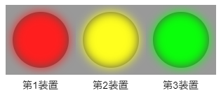

# node-red-dashboard-2-ui-lamps

## 名称

dashboard-2 - ui-lampsノード

## 機能概要

選択した「形状」「色」に応じた表示灯をダッシュボード上に「縦」もしくは「横」に並べて表示します。

## 入力メッセージ

入力メッセージを```msg.payload```から入力します。

```
[
    true,
    1,
    "ture",
    "1",
    false,
    0,
    "false",
    "0",
    "",
    null
]

```

以下のように、入力値に応じて、ランプの状態が変わります。

| 入力値 | データ型 | ランプの状態 |
|:-:|:-:|:-:|
|true|boolean|点灯|
|1|number|点灯|
|"true"|string|点灯|
|"1"|string|点灯|
|false|boolean|消灯|
|0|number|消灯|
|"false"|string|消灯|
|"0"|string|消灯|
|""|string|変化しない|
|null|null|変化しない|

## プロパティ

変換するデータに応じて、以下のパラメータを設定します。

| 名称(ja) | 名称(en-US) | 種別 | 説明 |
|:-|:-|:-:|:-|
|グループ|Group|dashborad group|結果を出力するダッシュボードグループを設定します。|
|サイズ|Size|number x number|ダッシュボード上に表示するサイズを設定します。|
|向き|Direction|string|ダッシュボード上に表示するランプの並べる向きを設定します。<br>プルダウンで「縦(Vertical)」、「横(Horizontal)」を選択できます。|
|形状|Phase|string|ダッシュボードに表示するランプの形状を設定します。<br>ランプ1個毎の設定が可能です。<br>プルダウンで「四角(Square)」、「丸(Circle)」を選択できます。|
|色|Color|string|ダッシュボードに表示するランプの色を設定します。<br>ランプ1個毎の設定が可能です。<br>プルダウンで「赤(Red)」、「緑(Green)」、「青(Blue)」、「黄(Yellow)」、「橙(Orange)」、「紫(Purple)」、「白(White)」を選択できます。|
|点灯させる値|truelist|string|点灯として扱う値をカンマ（,）区切りで入力します。|
|名前|Name|string|フローエディタ上で表示される名前を設定します。|

## 出力メッセージ
なし。
ダッシュボード上に、フローエディタのノード設定画面で設定した数だけ、設定した向きに並べてランプが出力されます。


